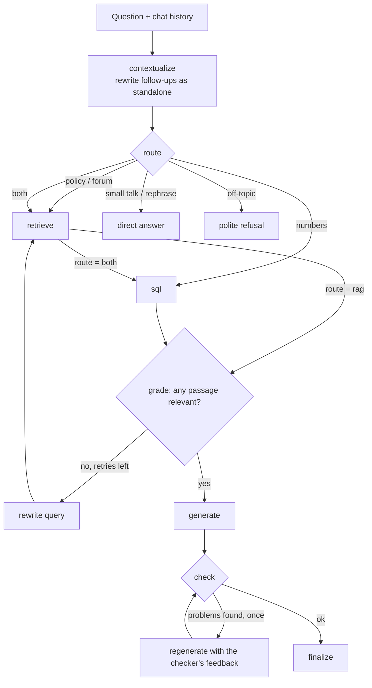

# IIT (BHU) Placement Assistant

An agentic RAG assistant for IIT (BHU) Varanasi students. Ask about placement and
internship rules, company CTCs and stipends, eligibility, or what students said about
a company's interviews. A LangGraph agent routes each question to the right source(s):
a **vector store** of policy text and forum interview experiences, a **SQL database**
of ~1,700 recruiters' offers across ten placement seasons, or both. It then checks
its own answer before returning it.

**Stack:** LangGraph · LangChain · OpenAI (`gpt-4o-mini`) · Chroma · SQLite ·
sentence-transformers · Streamlit · RAGAS

## Results

Measured with [RAGAS](https://docs.ragas.io) on 50 hand-verified questions (every
reference answer checked against the database rows or the policy text), before and after
the retrieval, data and verification fixes described below:

| Metric | Before | After |
|---|---|---|
| Faithfulness | 0.682 | **0.847** |
| Answer relevancy | 0.811 | **0.904** |
| Context precision | 0.673 | **0.823** |
| Context recall | 0.681 | **0.864** |

<sub>A few reference answers were corrected between the two runs after manual review,
and in the final run some individual scores were lost to API rate limits, so each
average there covers 46–50 questions.</sub>

Plus a **36-case deterministic regression suite** (`eval/run_eval.py`): one case per bug
found and fixed, so a fix can't silently regress.

## How it works



**Retrieval (`retrieve`)**
- The student's own question is always searched first, at full top-k. LLM-decomposed
  sub-queries (one per company or topic) and any rewrites only *add* results; they never
  replace the original search.
- The policy's own rule numbers are restored (the scrape had flattened them). Any rule
  split across chunks is swapped in whole, at the position its fragment ranked. A rule
  cited by another ("barring exceptions in Rule 4") is inserted right after the passage
  that cites it.
- When a company is named, its complete forum threads are pulled directly, not as
  fragments.

**Structured data (`sql`)**
- "Top N companies by CTC / take-home / stipend" questions (with degree, branch and year
  filters) are answered by a **deterministic query builder**, not LLM-written SQL.
- Company lookups resolve messy names ("Samsung Bengaluru", "C-DOT", "Walmart Labs")
  with whole-word matching, filter to the years asked about, and say so when rows were
  cut off.
- Everything else falls back to LLM-written SQL behind a read-only guardrail.

**Verification (`check`)**
- Answers from the database are checked **deterministically**: every ₹ figure must
  appear in the SQL result.
- Policy answers get an LLM review for unsupported claims and omitted conditions, and one
  regeneration that is shown those problems.

**Data pipeline (`src/ingest/`)**
- Policy markdown/PDF → header-aware chunks. Forum threads → chunks stamped with their
  company. Both are embedded into Chroma (`all-MiniLM-L6-v2`).
- Recruiter exports → a typed SQLite table. The parser separates CTC, take-home and
  monthly stipend, splits per-degree figures (B.Tech vs M.Tech), and flags
  foreign-currency offers. It refuses malformed amounts instead of guessing.

## Things that were broken, and how they were found

Most of the gain in the table came from tracing wrong answers to their root cause,
using the eval suite plus a step-by-step trace tool (`eval/debug_trace.py`):

- **Good retrievals thrown away.** On every failing policy question, the plain question
  retrieved the right clause at rank 1–2. A drifted query decomposition, or an
  over-strict relevance grader followed by a rewrite, had been *replacing* those results.
- **Silently truncated history.** Company lookups had a fixed `LIMIT 12`, newest first.
  For big recruiters that covered only the last two seasons, so the agent reported "no
  data for 2020-21" when the data existed.
- **Parser bugs in the salary data.** `10K PM` was read as ₹10 lakh a year. `per month`
  wasn't recognised, so 205 internship stipends were stored as annual CTCs. Dollar and
  AED offers were stored as rupees. Each fix was validated by rebuilding the database
  and diffing every row against the old version.
- **A checker that made answers worse.** On a correct top-10 table the LLM checker
  objected that a figure was "incorrectly stated" *as itself*, and the regeneration
  deleted a correct row. SQL answers are now checked deterministically instead.
- **Rules split across chunks.** A four-condition rule was cut after its second
  condition, so answers listed two of the four conditions that must all hold.

## Security & privacy

- **No private data in this repo.** The recruiter data and forum posts come from the
  login-protected Training & Placement portal. They were exported by the author with
  their own student account, for this personal project. The raw exports, the parsed
  text, the vector store, the SQL database, the evaluation sets built from them, and
  the export scripts all stay local (see `.gitignore`).
- **`scripts/audit_public_repo.py`** scans exactly what git would commit. It looks for
  private paths, API keys and tokens, phone numbers, emails, roll numbers, student
  handles, and, when the private export is present locally, every real forum poster's
  name. It fails the commit on any hit and never prints the matched value. Install it
  as a pre-commit hook: `copy scripts\pre-commit-hook .git\hooks\pre-commit`.
- **PII redaction at runtime** (`src/agent/pii.py`). Forum text is scrubbed of names,
  roll numbers, phone numbers, emails, handles and profile links before the LLM sees
  it. The same redacted text is what the evaluation logs.
- **Read-only SQL.** LLM-written SQL must be a single `SELECT` on the one known table;
  write, DDL and `ATTACH`/`PRAGMA` keywords are rejected, and results are row-capped.
- **Prompt-injection resistance.** Retrieved text is treated as data, never as
  instructions. Off-topic requests are refused, with a keyword backstop so genuine
  placement questions are never refused.
- **Secrets** live only in `.env` (gitignored); `.env.example` has empty placeholders.

## Running it

```bash
python -m venv .venv
.venv\Scripts\activate                    # Windows (source .venv/bin/activate elsewhere)
pip install -r requirements.txt
copy .env.example .env                    # then set OPENAI_API_KEY
```

The institute data isn't included (see above). To run the app, put your own exports in
`data/raw/`, in the formats documented at the top of `src/ingest/parse_forum.py` and
`src/ingest/build_sql_db.py`, then:

```bash
python -m scripts.restore_policy_rule_numbers   # once, after (re-)exporting the policy pages
python -m src.ingest.run_ingestion              # parse policy -> SQLite -> Chroma
streamlit run app.py                            # chat UI
python -m src.agent.graph                       # or a terminal chat (AGENT_DEBUG=1 for a trace)
```

Evaluation (needs your own test sets; formats are in each script's docstring):

```bash
python -m eval.run_eval                  # regression suite  (-k id1,id2 to run a subset)
python -m eval.run_ragas                 # RAGAS metrics     (-n 5 for a quick check)
python -m eval.debug_trace "question"    # every node's output for one question
```

## Project layout

```
app.py                      Streamlit chat UI
src/
  config.py                 paths, models, chunking, retrieval settings
  agent/
    graph.py                the LangGraph agent (nodes, prompts, checks)
    tools.py                retrieval, rule resolution, company resolution, SQL tools
    state.py                shared graph state
    pii.py                  PII redaction
  ingest/                   policy / forum / recruiter data -> Chroma + SQLite
eval/
  run_eval.py               deterministic regression suite
  run_ragas.py              RAGAS quality metrics
  debug_trace.py            step-by-step trace of the agent
  ragas_results.json        latest aggregate scores
scripts/
  audit_public_repo.py      pre-publish privacy/secret scan (+ pre-commit-hook)
  restore_policy_rule_numbers.py
```

## Limitations

- `gpt-4o-mini` occasionally varies its wording, or leaves out an exception, even at
  temperature 0. The checker catches some of these cases, not all.
- RAGAS's LLM judge sometimes scores a correct answer low: a single large table
  context, or a true fact not stated in the evidence (e.g. that CDOT is a government
  organisation). Low scores were reviewed by hand, not taken at face value.
- The policy text is the 2023-24 version published on the portal.

## Roadmap

- A small synthetic sample dataset, so anyone can run the full pipeline and the test
  suites without the private data.
- Docker image and a hosted demo on the synthetic data.
