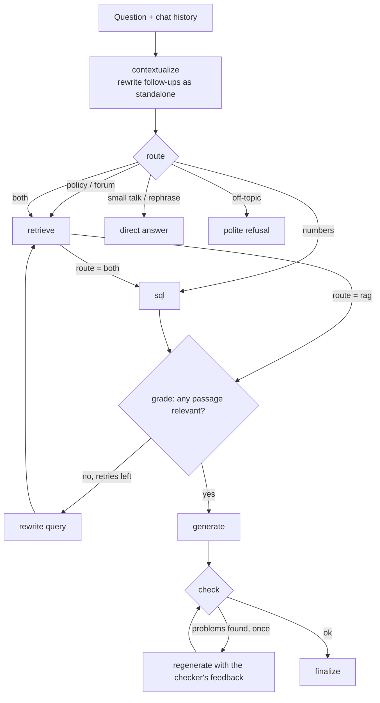

# IIT (BHU) Placement Assistant

**Live demo:** https://iitbhu-placement.streamlit.app (sign in with Google, 10 free questions a day)

A chat assistant for IIT (BHU) Varanasi students. Ask it about placement and internship rules, what companies paid (CTC and stipends), who is eligible, or what students said about a company's interviews.

It answers from two sources and picks the right one for each question:

- **Text search** over the placement policy and forum posts about interviews.
- **A database** of about 1,700 recruiters' offers across ten placement seasons.

Before showing an answer, it checks the answer against what it found.

**Built with:** LangGraph, LangChain, OpenAI (`gpt-4o-mini`), Chroma, SQLite, sentence-transformers, Streamlit, RAGAS.

## Results

Measured with [RAGAS](https://docs.ragas.io) on 50 questions whose correct answers I checked by hand against the database or the policy text. "Before" and "after" refer to the fixes listed further down.

| Metric | What it measures | Before | After |
|---|---|---|---|
| Faithfulness | Does the answer stick to what was found? | 0.682 | **0.847** |
| Answer relevancy | Does it answer the question asked? | 0.811 | **0.904** |
| Context precision | Is what was fetched actually relevant? | 0.673 | **0.823** |
| Context recall | Was everything needed fetched? | 0.681 | **0.864** |

<sub>A few reference answers were corrected between the two runs after manual review. In the final run some scores were lost to API rate limits, so each average covers 46 to 50 questions.</sub>

There is also a set of **36 fixed test cases** (`eval/run_eval.py`), one for each bug found and fixed, so a fix cannot quietly break again.

## How it works


```mermaid
flowchart TD
    Q[Question + chat history] --> C[contextualize<br/>rewrite follow-ups as standalone]
    C --> R{route}
    R -->|policy / forum| RET[retrieve]
    R -->|numbers| SQL[sql]
    R -->|both| RET
    R -->|small talk / rephrase| D[direct answer]
    R -->|off-topic| X[polite refusal]
    RET -->|route = both| SQL
    RET -->|route = rag| G{grade: any passage relevant?}
    SQL --> G
    G -->|no, retries left| W[rewrite query] --> RET
    G -->|yes| GEN[generate]
    GEN --> CH{check}
    CH -->|problems found, once| RG[regenerate with the checker's feedback] --> CH
    CH -->|ok| F[finalize]
```

In words:

1. **Understand the question.** A follow-up like "and for M.Tech?" is rewritten into a full question.
2. **Choose a source.** Rules and interview experiences go to text search. Numbers go to the database. Some questions need both. Off-topic questions are politely refused.
3. **Fetch.** If nothing relevant comes back, the search is reworded and tried again.
4. **Write the answer** from what was fetched.
5. **Check it.** If the check finds a problem, the answer is rewritten once with that feedback.

### Text search (`retrieve`)

- The student's own question is always searched first. Extra searches (one per company or topic) only **add** results; they never replace the original ones.
- The policy's rule numbers are restored (the export had lost them). A rule that was split across pieces is put back together, and a rule that another rule refers to is added next to it.
- When a company is named, its complete forum threads are fetched, not fragments.

### Database (`sql`)

- "Top N companies by CTC / take-home / stipend" questions, with degree, branch and year filters, are answered by a **fixed query builder**, not by SQL the model writes.
- Company names are matched loosely ("Samsung Bengaluru", "C-DOT", "Walmart Labs"), limited to the years asked about, and the answer says so if rows were cut off.
- Anything else falls back to model-written SQL, which is only allowed to read.

### Checking (`check`)

- For database answers, every rupee figure in the answer must appear in the query result. This is a plain code check, not a model's opinion.
- For policy answers, a second model call looks for unsupported claims and missing conditions.

### Preparing the data (`src/ingest/`)

- Policy text is split by heading. Forum threads are split and tagged with their company. Both are stored in Chroma using the `all-MiniLM-L6-v2` embedding model.
- Recruiter exports become one SQLite table. The parser separates CTC, take-home pay and monthly stipend, splits figures given per degree (B.Tech and M.Tech), flags offers in foreign currency, and rejects amounts it cannot read instead of guessing.

## Bugs I found, and how

Most of the improvement in the table came from tracing wrong answers back to their cause, using the test set and a step-by-step trace tool (`eval/debug_trace.py`).

- **Good search results were being thrown away.** For every failing policy question, the plain question already found the right rule at rank 1 or 2. A reworded search, or an over-strict relevance check, was **replacing** those results.
- **Company history was cut short.** Company lookups had a fixed limit of 12 rows, newest first. For big recruiters that covered only two seasons, so the assistant said "no data for 2020-21" when the data existed.
- **Salary parsing mistakes.** `10K PM` was read as ₹10 lakh a year. `per month` was not recognised, so 205 internship stipends were stored as yearly CTCs. Dollar and AED offers were stored as rupees. Each fix was checked by rebuilding the database and comparing every row with the old version.
- **A checker that made answers worse.** On a correct top-10 table, the model-based checker complained about a correct figure, and the rewrite deleted a correct row. Database answers are now checked by code instead.
- **Rules split in the middle.** A rule with four conditions was cut after the second, so answers listed only two of the four.

## Privacy and safety

- **No private data in this repository.** The recruiter data and forum posts come from the login-protected Training & Placement portal and are used with the TnP cell's permission. They are never committed here. The hosted app fetches them at start-up from a separate private repository, using a read-only token.
- **Personal details are removed** from forum text (names, roll numbers, phone numbers, emails, handles) before the model sees it (`src/agent/pii.py`). A script (`scripts/audit_public_repo.py`) also scans every commit for private data and keys before it can be published.
- **Usage is limited.** The hosted app needs a Google sign-in, which makes the limit of 10 questions per person per day possible. There is also a daily cap for the whole app (`src/app_guard.py`).
- **The model can only read.** Model-written SQL must be a single `SELECT` on the one known table, and results are capped. Text fetched from documents is treated as information, never as instructions.

## Running it

```bash
python -m venv .venv
.venv\Scripts\activate                    # Windows (source .venv/bin/activate elsewhere)
pip install -r requirements.txt
copy .env.example .env                    # then set OPENAI_API_KEY
```

The institute's data is not included. To run the app, put your own exports in `data/raw/`, in the formats described at the top of `src/ingest/parse_forum.py` and `src/ingest/build_sql_db.py`, then:

```bash
python -m scripts.restore_policy_rule_numbers   # once, after exporting the policy pages
python -m src.ingest.run_ingestion              # builds the SQLite database and the Chroma store
streamlit run app.py                            # the chat app
```

A terminal chat is also available: `python -m src.agent.graph` (set `AGENT_DEBUG=1` to see each step).

Run locally without sign-in settings, the app skips sign-in and uses your local `data/` folder.

To run the evaluation (you need your own test sets; the formats are in each script's docstring):

```bash
python -m eval.run_eval                  # the 36 fixed cases  (-k id1,id2 runs a subset)
python -m eval.run_ragas                 # RAGAS scores        (-n 5 for a quick check)
python -m eval.debug_trace "question"    # every step's output for one question
```

To put it online, see [DEPLOY.md](DEPLOY.md).

## Project layout

```
app.py                      Streamlit chat app (Google sign-in and daily limit when hosted)
src/
  config.py                 paths, models, search settings
  app_guard.py              sign-in check and daily limits
  data_bootstrap.py         fetches the private data on first start
  agent/
    graph.py                the LangGraph agent (steps, prompts, checks)
    tools.py                text search, rule and company lookup, SQL tools
    state.py                what is passed between steps
    pii.py                  removes personal details
  ingest/                   policy, forum and recruiter data -> Chroma + SQLite
eval/
  run_eval.py               the 36 fixed test cases
  run_ragas.py              RAGAS scores
  debug_trace.py            step-by-step trace of one question
  ragas_results.json        latest average scores
scripts/
  audit_public_repo.py      scan for private data and keys before publishing (+ pre-commit-hook)
  package_private_data.py   builds the private data repository for deployment
  restore_policy_rule_numbers.py
```

## Limitations

- `gpt-4o-mini` sometimes varies its wording or leaves out an exception, even at temperature 0. The check catches some of these, not all.
- RAGAS scores come from a model acting as judge, and it sometimes marks a correct answer low (for example, a single large table, or a true fact that is not in the fetched text). Low scores were reviewed by hand.
- The policy text is the 2023-24 version published on the portal.

## Next step

A small made-up sample dataset, so anyone outside IIT (BHU) can run the pipeline and the tests without the private data.
